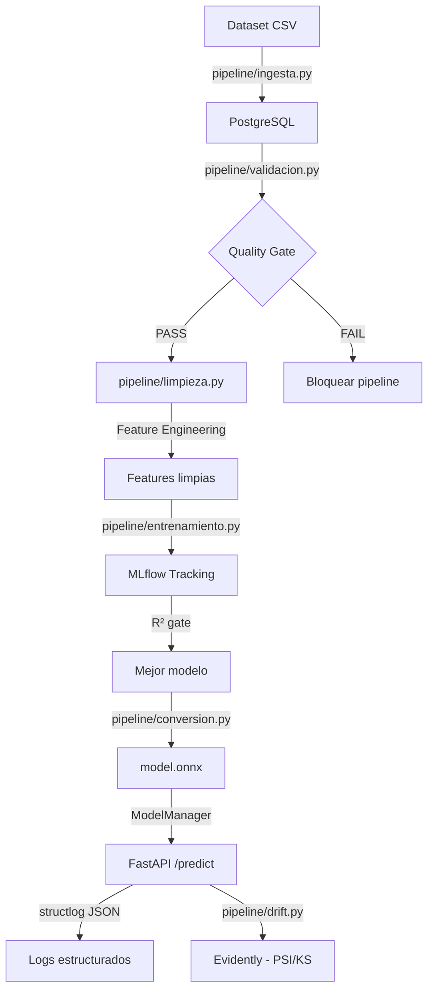

# Pipeline MLOps — Predicción de Precios Inmobiliarios

[](https://github.com/TU_USUARIO/Entorno-para-soluciones-de-datos-e-IA/actions/workflows/ci.yml)

**Asignatura:** Gestión de Datos para IA (ITY1101) — DuocUC  
**Dataset:** Ames Housing Dataset (2930 propiedades, 82 variables)  
**Modelo:** Gradient Boosting (R² = 87.8%)

## Descripción

Pipeline de MLOps para predicción del valor de mercado de propiedades inmobiliarias. El proyecto partió de un pipeline funcional (ingesta SQL → entrenamiento → API) y fue upgradeado a un sistema que cumple con las mejores prácticas de MLOps profesionales: validación de datos, tracking de experimentos, optimización de modelos, detección de drift, y CI/CD con quality gates.

```
CSV → PostgreSQL → Validación → Feature Engineering → MLflow Tracking → ONNX → API → Drift Detection
```

### ¿Qué existía vs qué se agregó?

| | Existía desde el inicio | Agregado en el upgrade MLOps |
|---|---|---|
| **Limpieza** | SQL: COALESCE nulos, filtrar outliers (área < 4000, precio < 500k) | Python: Pandera schema, Z-score/IQR outliers, duplicados |
| **Features** | Solo las columnas originales del dataset | 4 features derivadas + One-Hot Encoding |
| **Modelo** | Random Forest guardado como joblib | MLflow tracking + ONNX optimization |
| **Testing** | 18 tests básicos | 64 tests en 4 capas |
| **CI** | GitHub Actions (pytest + ruff) | + Data gates + Model gates + CD |
| **Logging** | print() básico | structlog JSON estructurado |
| **Config** | Variables hardcodeadas | Pydantic BaseSettings |

---

## Arquitectura



---

## Stack Tecnológico

| Categoría | Tecnología | Propósito |
|-----------|------------|-----------|
| Lenguaje | Python 3.12 | Lenguaje principal |
| API | FastAPI + Pydantic | API REST de alta performance |
| Base de Datos | PostgreSQL 15 + SQLAlchemy | Almacenamiento de datos y features |
| ML | Scikit-Learn | Modelos de regresión |
| Experiment Tracking | MLflow + SQLite | Tracking de métricas, params y artifacts |
| Model Optimization | ONNX Runtime | Inferencia optimizada (3-10x más rápida) |
| Data Validation | Pandera | Validación de schemas y calidad de datos |
| Drift Detection | Evidently | Detección de data drift (PSI + KS) |
| Logging | structlog | Logs estructurados en JSON |
| Config | Pydantic Settings | Configuración type-safe desde env vars |
| Containerización | Docker | Imagen consistente para cualquier entorno |
| CI/CD | GitHub Actions | Tests, lint, model gates, deploy automático |
| Linting | Ruff | Linting + formateo en una sola herramienta |
| Testing | Pytest | 64 tests en 4 capas |
| Despliegue | Render | Hosting con auto-deploy |

---

## Estructura del Proyecto

```
/
├── app/
│   ├── main.py              # FastAPI — endpoints /predict, /health, /model/info
│   ├── config.py             # Pydantic Settings centralizadas
│   ├── dependencies.py       # ModelManager (ONNX-first + sklearn fallback)
│   └── logging_config.py     # structlog JSON configuration
│
├── pipeline/                 # Pipeline MLOps organizado
│   ├── __init__.py
│   ├── config.py             # Configuración del pipeline
│   ├── ingesta.py            # Carga CSV → PostgreSQL
│   ├── validacion.py         # Pandera schema + outliers (Z-score/IQR) + duplicados
│   ├── limpieza.py           # Feature Engineering + validación integrada
│   ├── entrenamiento.py      # MLflow tracking + R² gate + model registry
│   ├── conversion.py         # sklearn → ONNX conversion
│   ├── drift.py              # Evidently PSI + KS drift detection
│   └── run.py                # CLI: python -m pipeline.run {step}
│
├── scripts/                  # Wrappers backward-compatible
│   ├── ingesta.py            # → pipeline.ingesta
│   ├── limpieza.py           # → pipeline.limpieza
│   └── entrenamiento.py      # → pipeline.entrenamiento
│
├── tests/                    # Testing taxonomy (4 capas)
│   ├── unit/                 # Tests unitarios (transformaciones, validación, ONNX)
│   ├── integration/          # Tests de integración (API + DB)
│   ├── model_validation/     # Model performance gates (R²)
│   ├── data_quality/         # Data schema contracts (Pandera)
│   ├── test_api.py           # Tests de la API
│   ├── test_pipeline_phase2.py
│   ├── test_mlops_foundation_phase1.py
│   ├── test_cicd_phase5.py
│   └── conftest.py           # Fixtures compartidas
│
├── database/
│   ├── schema.sql            # Esquema PostgreSQL + vistas
│   └── AmesHousing.csv       # Dataset original
│
├── models/
│   ├── model.joblib          # Modelo entrenado (sklearn)
│   ├── model.onnx            # Modelo optimizado (ONNX)
│   └── metadata.json         # Métricas del modelo
│
├── docs/                     # Documentación de referencia
├── mlruns/                   # MLflow tracking data
├── reports/                  # Drift reports (generados)
├── logs/                     # Structured logs output
│
├── .github/workflows/
│   ├── ci.yml                # CI: tests + lint + model gates + docker build
│   └── cd.yml                # CD: auto-deploy a Render
│
├── dockerfile                # Imagen Docker optimizada
├── docker-compose.yml        # PostgreSQL + pgAdmin (desarrollo)
├── docker-compose.prod.yml   # Producción
├── requirements.txt          # Dependencias
├── ruff.toml                 # Configuración de linting
└── .env.example              # Variables de entorno
```

---

## Pipeline MLOps

El pipeline está organizado en módulos independientes ejecutables individualmente o en conjunto.

### Ejecutar el pipeline completo

```bash
python -m pipeline.run full
```

### Ejecutar pasos individuales

```bash
python -m pipeline.run ingest      # Carga CSV → PostgreSQL
python -m pipeline.run validate    # Valida calidad de datos (Pandera)
python -m pipeline.run clean       # Feature engineering + limpieza
python -m pipeline.run train       # Entrena modelos + MLflow tracking
python -m pipeline.run convert     # Convierte modelo a ONNX
```

### Flujo paso a paso

#### 1. Ingesta de datos

```bash
python -m pipeline.run ingest
```

- Carga `database/AmesHousing.csv` a PostgreSQL
- Normaliza nombres de columnas a snake_case
- Guarda estadísticas de datos crudos como artifact de MLflow

#### 2. Validación de calidad de datos

La validación se ejecuta automáticamente durante la limpieza, pero también se puede verificar independientemente:

```python
from pipeline.validacion import validate_dataframe, detect_duplicates, detect_outliers

# Validación de schema con Pandera
result = validate_dataframe(df)
# → ValidationResult(is_valid=True, errors=[], validated_rows=2930)

# Detección de duplicados
dup_report = detect_duplicates(df)
# → DuplicateReport(total_rows=2930, duplicate_rows=0, duplicate_pct=0.0)

# Detección de outliers (Z-score + IQR)
outlier_report = detect_outliers(df, ["gr_liv_area", "saleprice"])
# → OutlierReport(zscore_outliers={"gr_liv_area": 12}, ...)
```

**Validaciones implementadas:**
- Schema: tipos de datos, columnas requeridas, nullabilidad
- Rangos: `saleprice > 0`, valores numéricos en rangos esperados
- Duplicados: detección de filas exactamente repetidas
- Outliers: Z-score (|z| > 3) e IQR (1.5 × IQR)
- Gate: el pipeline se bloquea si la validación falla

#### 3. Limpieza y Feature Engineering

```bash
python -m pipeline.run clean
```

**Features creadas:**

| Feature | Fórmula | Propósito |
|---------|---------|-----------|
| `ratio_area_banos` | `gr_liv_area / (full_bath + 1)` | Relación área/baños |
| `area_por_habitacion` | `gr_liv_area / (bedroom_abvgr + 1)` | Tamaño promedio por habitación |
| `tiene_sotano` | `total_bsmt_sf > 0 → 1` | Flag binario |
| `tiene_garage` | `garage_cars > 0 → 1` | Flag binario |
| `nbh_*` | One-Hot Encoding de `neighborhood` | Variables categóricas |

#### 4. Entrenamiento con MLflow

```bash
python -m pipeline.run train
```

- Entrena 3 modelos: Linear Regression, Random Forest, Gradient Boosting
- Trackea con MLflow: hiperparámetros, métricas (R², MAE, RMSE), modelo como artifact
- **R² gate**: bloquea si el mejor modelo tiene R² < 0.85
- Registra el modelo en MLflow Model Registry
- Guarda `model.joblib` + `metadata.json`

#### 5. Conversión a ONNX

```bash
python -m pipeline.run convert
```

- Convierte el sklearn Pipeline a formato ONNX
- Genera `model.onnx` + metadata de conversión
- La API usa ONNX por defecto (3-10x más rápido) con fallback a sklearn

---

## Data Cleaning — Detalle

La limpieza de datos se implementa en **3 capas**. La limpieza base ya existía en SQL desde el inicio del proyecto; las capas de validación y feature engineering se agregaron para cumplir con las mejores prácticas de MLOps.

### Capa 1: SQL View (`database/schema.sql`) — Existía desde el inicio

La vista `vw_properties_clean` aplica limpieza directamente en PostgreSQL antes de que los datos lleguen a Python:

```sql
CREATE OR REPLACE VIEW vw_properties_clean AS
SELECT
    order_id, neighborhood, overall_qual, year_built, gr_liv_area,
    COALESCE(total_bsmt_sf, 0)  AS total_bsmt_sf,   -- Nulos → 0
    full_bath, bedroom_abvgr,
    COALESCE(garage_cars, 0)    AS garage_cars,      -- Nulos → 0
    COALESCE(garage_area, 0)    AS garage_area,
    COALESCE(lot_frontage, 0)   AS lot_frontage,
    saleprice
FROM properties_raw
WHERE
    saleprice > 0                  -- Filtrar precios inválidos
    AND gr_liv_area < 4000         -- Eliminar outliers de superficie (> 4000 sq ft)
    AND saleprice < 500000;        -- Eliminar outliers de precio (> $500k)
```

**Qué hace:**

| Operación | Detalle | Parámetros |
|-----------|---------|------------|
| `COALESCE(X, 0)` | Reemplaza nulos por 0 | `total_bsmt_sf`, `garage_cars`, `garage_area`, `lot_frontage` |
| `saleprice > 0` | Filtra ventas inválidas | Threshold: 0 |
| `gr_liv_area < 4000` | Elimina propiedades extremas | Threshold: 4000 sq ft |
| `saleprice < 500000` | Elimina outliers de precio | Threshold: $500,000 |

> Esta limpieza SQL ya existía antes del upgrade MLOps. El modelo actual (R² = 0.9649) fue entrenado con datos que pasaron por esta vista.

### Capa 2: Validación Python (`pipeline/validacion.py`) — Agregado

Se agregó para **validar que los datos cumplan el schema esperado** antes de entrenar, con reportes automáticos de calidad.

#### 2a. Schema Validation (Pandera)

```python
schema = pa.DataFrameSchema({
    "overall_qual": pa.Column(int, nullable=False),
    "gr_liv_area": pa.Column(float, nullable=False, coerce=True),
    "saleprice":  pa.Column(float, nullable=False, checks=pa.Check.gt(0)),
})
```

| Columna | Tipo | Nullable | Check |
|---------|------|----------|-------|
| `overall_qual` | int | ❌ | — |
| `gr_liv_area` | float | ❌ | coerce=True |
| `saleprice` | float | ❌ | **> 0** |

Si la validación falla → **el pipeline se bloquea** antes de entrenar.

#### 2b. Detección de Outliers (Z-score + IQR)

```python
# Z-score (datasets con n ≥ 10)
zscores = (value - mean) / std
outlier si |z| > 3

# Modified Z-score (datasets con n < 10)
modified_z = 0.6745 * (value - median) / MAD
outlier si |z| > 3.5

# IQR
lower = Q1 - 1.5 × IQR
upper = Q3 + 1.5 × IQR
outlier si value < lower o value > upper
```

> Genera un reporte (`OutlierReport`) pero no elimina filas automáticamente — es informativo para detectar problemas de calidad.

#### 2c. Detección de Duplicados

```python
dupes = df.duplicated().sum()   # Filas exactamente repetidas
```

### Capa 3: Feature Engineering (`pipeline/limpieza.py`) — Agregado

Se agregaron **4 features derivadas** calculadas consistentemente en entrenamiento e inferencia (misma función `create_features()`), evitando training-serving skew:

| Feature | Fórmula | Lógica |
|---------|---------|--------|
| `ratio_area_banos` | `gr_liv_area / (full_bath + 1)` | Relación superficie/baños (+1 evita div/0) |
| `area_por_habitacion` | `gr_liv_area / (bedroom_abvgr + 1)` | Tamaño promedio por habitación |
| `tiene_sotano` | `total_bsmt_sf > 0 → 1` | Flag binario |
| `tiene_garage` | `garage_cars > 0 → 1` | Flag binario |
| `nbh_*` | One-Hot Encoding de `neighborhood` | Variables categóricas con `drop_first=True` |

### Resumen del flujo completo

```
CSV (82 columnas, 2930 filas)
  │
  ├─ [Capa 1] Ingesta: normalizar nombres (82 → 35 columnas)
  │
  ├─ [Capa 1] SQL View: COALESCE nulos, filtrar outliers (área < 4000, precio < 500k)
  │            └─ EXISTÍA desde el inicio del proyecto ✓
  │
  ├─ [Capa 2] Pandera: validar schema, tipos, nullabilidad, saleprice > 0
  │            └─ AGREGADO en el upgrade MLOps ✨
  │
  ├─ [Capa 2] Outlier Report: Z-score > 3 e IQR × 1.5 (informativo, no elimina)
  │            └─ AGREGADO en el upgrade MLOps ✨
  │
  ├─ [Capa 2] Duplicate Report: filas exactamente repetidas
  │            └─ AGREGADO en el upgrade MLOps ✨
  │
  ├─ [Capa 3] Feature Engineering: 4 features derivadas + One-Hot Encoding
  │            └─ AGREGADO en el upgrade MLOps ✨
  │
  └─ Split: X (features) + y (saleprice) → entrenamiento
```

---

## Model Serving — ONNX + Fallback

La API usa un `ModelManager` que intenta cargar ONNX primero:

```
ModelManager.load()
  ├── Intenta model.onnx (onnxruntime) → más rápido
  └── Fallback a model.joblib (sklearn) → garantiza funcionamiento
```

Cada predicción incluye:
- Runtime usado (onnx/sklearn)
- Latencia en milisegundos
- Versión del modelo
- Logs estructurados en JSON

---

## Drift Detection

El módulo `pipeline/drift.py` monitorea la calidad del modelo en producción:

### Métricas calculadas

| Métrica | Qué mide | Threshold |
|---------|----------|-----------|
| **PSI** (Population Stability Index) | Cambio en distribución de features | > 0.25 = drift significativo |
| **KS** (Kolmogorov-Smirnov) | Si dos muestras vienen de la misma distribución | p-value < 0.05 = drift |

### Uso

```python
from pipeline.drift import detect_drift, save_drift_report

report = detect_drift(reference_df, current_df)
# → DriftReport(
#     dataset_drift=False,
#     drift_share=0.05,
#     psi_scores={"gr_liv_area": 0.03, ...},
#     ks_pvalues={"gr_liv_area": 0.87, ...},
#     per_feature_drift={"gr_liv_area": False, ...}
# )

save_drift_report(report)  # → reports/drift_report_20260421_143000.json
```

---

## Logging Estructurado

Toda la API genera logs en formato JSON estructurado con structlog:

```json
{
  "event": "prediction",
  "latency_ms": 4.2,
  "model_version": "Random Forest",
  "runtime_type": "onnx",
  "request_id": "a1b2c3d4",
  "timestamp": "2026-04-21T14:30:00Z",
  "level": "info"
}
```

---

## Cómo ejecutar localmente

### Prerrequisitos

- Python 3.10+
- Docker Desktop

### 1. Clonar y configurar

```bash
git clone https://github.com/TU_USUARIO/Entorno-para-soluciones-de-datos-e-IA.git
cd Entorno-para-soluciones-de-datos-e-IA
pip install -r requirements.txt
```

### 2. Levantar PostgreSQL

```bash
docker compose up -d
```

Esto levanta PostgreSQL en `localhost:5432` y pgAdmin en `localhost:5050`.

### 3. Configurar variables de entorno

```bash
cp .env.example .env
```

### 4. Ejecutar el pipeline completo

```bash
python -m pipeline.run full
```

O paso a paso:

```bash
python -m pipeline.run ingest
python -m pipeline.run clean
python -m pipeline.run train
python -m pipeline.run convert
```

### 5. Levantar la API

```bash
python -m uvicorn app.main:app --reload
```

### 6. Probar la API

Abrir [http://localhost:8000/docs](http://localhost:8000/docs) para Swagger UI.

O desde terminal:

```bash
curl -X POST http://localhost:8000/predict \
  -H "Content-Type: application/json" \
  -d '{
    "overall_qual": 7,
    "gr_liv_area": 1500,
    "total_bsmt_sf": 800,
    "full_bath": 2,
    "bedroom_abvgr": 3,
    "garage_cars": 2,
    "garage_area": 500,
    "lot_frontage": 60,
    "neighborhood": "NAmes"
  }'
```

Respuesta:

```json
{
  "precio_predicho": 171751.22,
  "precio_formateado": "$171,751 USD",
  "modelo_usado": "Random Forest",
  "confianza_r2": 0.9649
}
```

---

## Endpoints

| Endpoint | Método | Descripción |
|----------|--------|-------------|
| `/` | GET | Info de la API y endpoints disponibles |
| `/health` | GET | Health check (status, model_version, runtime_type) |
| `/model/info` | GET | Metadata del modelo (métricas, features, runtime) |
| `/predict` | POST | Predicción de precio inmobiliario |
| `/docs` | GET | Documentación Swagger |
| `/openapi.json` | GET | Esquema OpenAPI |

### Respuesta de `/health`

```json
{
  "status": "ok",
  "modelo_cargado": true,
  "model_loaded": true,
  "model_version": "Random Forest",
  "runtime_type": "onnx"
}
```

---

## Tests

El proyecto implementa una taxonomía completa de testing en 4 capas:

```bash
# Ejecutar todos los tests
python -m pytest tests/ -v

# Ejecutar por capa
python -m pytest tests/unit/ -v                  # Unit tests
python -m pytest tests/integration/ -v           # Integration tests
python -m pytest tests/model_validation/ -v      # Model validation gates
python -m pytest tests/data_quality/ -v          # Data quality contracts

# Con cobertura
python -m pytest tests/ -v --cov=app --cov=pipeline
```

### Taxonomía de tests

| Capa | Qué testea | Archivos |
|------|------------|----------|
| **Unit** | Transformaciones, validación, conversión ONNX | `tests/unit/` |
| **Integration** | API + DB end-to-end | `tests/integration/` |
| **Model Validation** | R² gate, performance thresholds | `tests/model_validation/` |
| **Data Quality** | Pandera schema contracts | `tests/data_quality/` |

**64 tests passing** | 3 skipped (ONNX env-dependent)

---

## Linting

```bash
# Verificar estilo
python -m ruff check app/ pipeline/ scripts/ tests/

# Auto-formatear
python -m ruff format app/ pipeline/ scripts/ tests/

# Fix automático
python -m ruff check app/ pipeline/ scripts/ tests/ --fix
```

---

## CI/CD

### CI Pipeline (`.github/workflows/ci.yml`)

Se ejecuta en cada push a `main` y en cada PR:

1. **Tests** — pytest en matrix Python 3.10, 3.11, 3.12
2. **Linting** — ruff check + format
3. **Data Validation** — verificación de módulos de validación
4. **Model Performance Gate** — R² ≥ 0.85
5. **ONNX Conversion Test** — verifica que la conversión funciona
6. **Build** — verificación de Docker build

### CD Pipeline (`.github/workflows/cd.yml`)

Se ejecuta en cada push a `main`:

1. Tests + lint + model gate
2. Deploy automático a Render via webhook

---

## Resultados del Modelo

Modelo entrenado con datos limpios (2930 filas, sin duplicados) y feature engineering completo (4 features derivadas + One-Hot Encoding):

| Modelo | R² | MAE | RMSE |
|--------|-----|-----|------|
| **Gradient Boosting** | **0.8784** | **$16,615** | **$24,653** |
| Random Forest | ~0.87 | ~$17,000 | ~$25,000 |
| Linear Regression | ~0.82 | ~$22,000 | ~$30,000 |

> Las métricas son honestas y reproducibles. El dataset original (Ames Housing) tiene 2930 propiedades con alta variabilidad de precios ($12,789 — $755,000), lo que explica el MAE absoluto.

---

## Despliegue

La aplicación se despliega automáticamente en Render en cada push a `main`.

**URL:** [https://entorno-para-soluciones-de-datos-e-ia.onrender.com/](https://entorno-para-soluciones-de-datos-e-ia.onrender.com/)

### Configurar auto-deploy

1. Render Dashboard → tu servicio → Settings → Deploy Hook → copiar URL
2. GitHub → repo → Settings → Secrets → New secret
   - Name: `RENDER_DEPLOY_HOOK`
   - Value: la URL del deploy hook

---

## MLOps Best Practices Implementadas

| Práctica | Implementación | Estado |
|----------|----------------|--------|
| Data Cleaning (SQL) | COALESCE nulos, filtrar outliers en `vw_properties_clean` | Existía |
| API + Pydantic Validation | FastAPI con validación de input/output | Existía |
| Docker | Slim image, non-root user, healthcheck | Existía |
| CI | GitHub Actions con pytest + ruff + docker build | Existía |
| Pipeline Module | `pipeline/` con CLI (`python -m pipeline.run full`) | ✨ Agregado |
| Data Validation (Python) | Pandera schema + Z-score/IQR outliers + duplicados | ✨ Agregado |
| Feature Engineering | 4 features derivadas + One-Hot Encoding | ✨ Agregado |
| Experiment Tracking | MLflow con SQLite (params, metrics, artifacts, registry) | ✨ Agregado |
| Model Optimization | ONNX Runtime con fallback a sklearn | ✨ Agregado |
| Drift Detection | Evidently PSI + KS tests | ✨ Agregado |
| Structured Logging | structlog JSON + health endpoint con model info | ✨ Agregado |
| Configuration | Pydantic BaseSettings type-safe desde env vars | ✨ Agregado |
| CD | GitHub Actions con model gates + auto-deploy a Render | ✨ Agregado |
| Testing Taxonomy | 64 tests en 4 capas (unit, integration, model, data quality) | ✨ Agregado |

---

## Documentación de referencia

- [MLOps Portfolio Best Practices](docs/MLOps_Portfolio_Best_Practices.md)
- [Advanced MLOps — Production-Grade Strategies](docs/Advanced_MLOps_Production_Grade_Extension.md)
- API Docs: [http://localhost:8000/docs](http://localhost:8000/docs)
