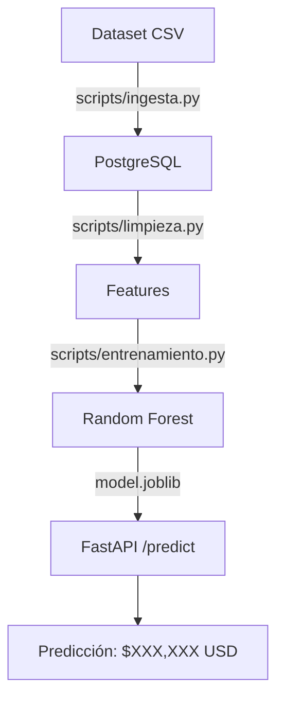

# 🏠 Pipeline de Predicción de Precios Inmobiliarios

[](https://github.com/TU_USUARIO/Entorno-para-soluciones-de-datos-e-IA/actions/workflows/ci.yml)

**Asignatura:** Gestión de Datos para IA (ITY1101) — DuocUC  
**Dataset:** Ames Housing Dataset (2930 propiedades, 82 variables)  
**Modelo:** Random Forest (R² = 96.5%)

## 📝 Descripción

Pipeline completo de Machine Learning para predicción del valor de mercado de propiedades inmobiliarias. El proyecto implementa el flujo completo desde la ingesta de datos crudos hasta una API REST que predice precios en tiempo real.

```
CSV → PostgreSQL → Feature Engineering → Entrenamiento → API → Predicción
```

## 🏗️ Arquitectura



## 📂 Estructura del Proyecto

```
/
├── app/
│   └── main.py              # API FastAPI con /predict
├── data/                    # Dataset fuente (no versionado)
├── database/
│   ├── schema.sql           # Esquema PostgreSQL + vistas
│   └── AmesHousing.csv      # Dataset original
├── docs/
│   ├── planificacion.md     # Planificación PMBOK
│   └── diseno_tecnico.md    # Diseño técnico
├── models/                  # Modelo entrenado (.joblib)
│   ├── model.joblib
│   └── metadata.json
├── scripts/
│   ├── ingesta.py           # Carga CSV → PostgreSQL
│   ├── limpieza.py          # Feature Engineering
│   └── entrenamiento.py     # Entrena 3 modelos, guarda el mejor
├── tests/
│   └── test_api.py          # 18 tests con mocks
├── .github/workflows/
│   └── ci.yml               # CI: Tests + Linting + Build
├── docker-compose.yml       # Desarrollo: PostgreSQL + pgAdmin
├── docker-compose.prod.yml  # Producción: PostgreSQL + API
├── dockerfile               # Imagen Docker de la API
├── ruff.toml                # Configuración del linter
├── requirements.txt         # Dependencias Python
├── .env.example             # Variables de entorno
└── README.md
```

## 🛠️ Stack Tecnológico

| Categoría | Tecnología |
|-----------|------------|
| Lenguaje | Python 3.12 |
| API | FastAPI + Pydantic |
| Base de Datos | PostgreSQL 15 + SQLAlchemy |
| Machine Learning | Scikit-Learn (Random Forest, Gradient Boosting, Linear Regression) |
| Contenerización | Docker + Docker Compose |
| CI/CD | GitHub Actions (Tests + Linting + Build) |
| Linting | Ruff |
| Testing | Pytest + Mocks |
| Despliegue | Render |

## 🚀 Cómo ejecutar localmente

### Prerrequisitos
- Python 3.10+
- Docker Desktop instalado

### 1. Clonar y configurar entorno

```bash
git clone https://github.com/TU_USUARIO/Entorno-para-soluciones-de-datos-e-IA.git
cd Entorno-para-soluciones-de-datos-e-IA
pip install -r requirements.txt
```

### 2. Levantar PostgreSQL con Docker

```bash
docker compose up -d
```

Esto levanta:
- PostgreSQL en `localhost:5432`
- pgAdmin en `localhost:5050` (login: admin@housing.com / admin)

### 3. Configurar variables de entorno

```bash
cp .env.example .env
```

### 4. Ejecutar ingesta de datos

```bash
python scripts/ingesta.py
```

### 5. Entrenar el modelo

```bash
python scripts/entrenamiento.py
```

Esto entrena 3 modelos y guarda el mejor en `models/model.joblib`.

### 6. Levantar la API

```bash
python -m uvicorn app.main:app --reload
```

### 7. Probar la API

Abrir en el navegador: [http://localhost:8000/docs](http://localhost:8000/docs)

O desde terminal:

```bash
curl -X POST http://localhost:8000/predict \
  -H "Content-Type: application/json" \
  -d '{
    "overall_qual": 7,
    "gr_liv_area": 1500,
    "total_bsmt_sf": 800,
    "full_bath": 2,
    "bedroom_abvgr": 3,
    "garage_cars": 2,
    "garage_area": 500,
    "lot_frontage": 60,
    "neighborhood": "NAmes"
  }'
```

Respuesta:
```json
{
  "precio_predicho": 171751.22,
  "precio_formateado": "$171,751 USD",
  "modelo_usado": "Random Forest",
  "confianza_r2": 0.9649
}
```

## 🧪 Tests

```bash
# Ejecutar todos los tests
python -m pytest tests/ -v

# Ejecutar con cobertura
python -m pytest tests/ -v --cov=app
```

## 🔍 Linting

```bash
# Verificar estilo de código
ruff check app/ scripts/ tests/

# Auto-formatear
ruff format app/ scripts/ tests/
```

## 🌐 Despliegue en Render

La aplicación se despliega automáticamente en cada push a `main`.

**URL:** [https://entorno-para-soluciones-de-datos-e-ia.onrender.com/](https://entorno-para-soluciones-de-datos-e-ia.onrender.com/)

## 📊 Resultados del Modelo

| Modelo | R² | MAE | RMSE |
|--------|-----|-----|------|
| **Random Forest** 🏆 | **0.9649** | **$9,210** | **$13,808** |
| Gradient Boosting | 0.9448 | $12,938 | $17,316 |
| Linear Regression | 0.8700 | $19,025 | $26,569 |

## 📚 Documentación

- [Planificación PMBOK](docs/planificacion.md)
- [Diseño Técnico](docs/diseno_tecnico.md)
- API Docs: [http://localhost:8000/docs](http://localhost:8000/docs)

## 🎯 Endpoints

| Endpoint | Método | Descripción |
|----------|--------|-------------|
| `/` | GET | Info de la API |
| `/health` | GET | Health check |
| `/model/info` | GET | Metadata del modelo |
| `/predict` | POST | Predicción de precio |
| `/docs` | GET | Documentación Swagger |
