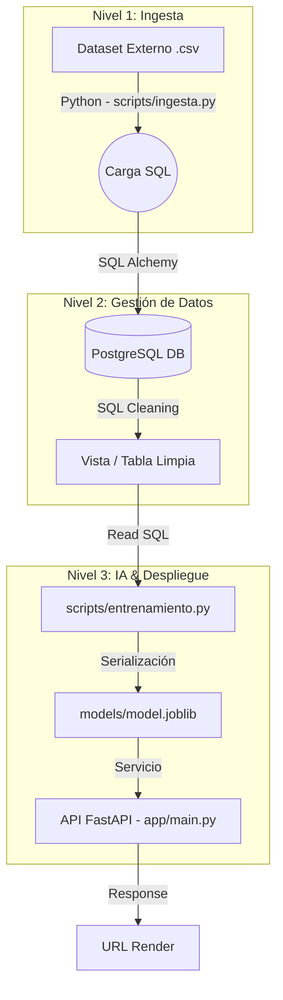

# Diseño Técnico - Arquitectura de Gestión de Datos e IA
_Última actualización: 2026-03-26_

## 1. Arquitectura de Flujo de Datos
El proyecto implementa un flujo de datos desacoplado que garantiza que la Inteligencia Artificial siempre consuma información validada desde un repositorio central de datos.

## 2. Definición de Módulos
### 2.1 Ingesta y Persistencia (`scripts/ingesta.py`)
Utiliza la librería `pandas` y `sqlalchemy` para leer el archivo fuente y persitir los datos en una tabla raw en PostgreSQL. Esto cumple con el requisito de **Gestión de Datos** del ramo.

### 2.2 Transformación y Limpieza
Se realiza en dos capas:
*   **Capa DB**: Definición de tipos y restricciones en `database/schema.sql`.
*   **Capa Aplicación**: Imputación de nulos y escalamiento en `scripts/entrenamiento.py` antes del ajuste del modelo.

### 2.3 Entrenamiento y Despliegue
El script de entrenamiento extrae las características finales consultando la base de datos, lo que permite que el pipeline sea reproducible si la base de datos se actualiza.

## 3. Infraestructura (Docker & Cloud)
*   **Entorno Local**: Contenedor Docker para PostgreSQL y App.
*   **Entorno Cloud**: Render Web Service + Render Managed Database.
*   **CI/CD**: GitHub Actions para validar que la migración de datos y la importación de la app funcionen en cada commit.
